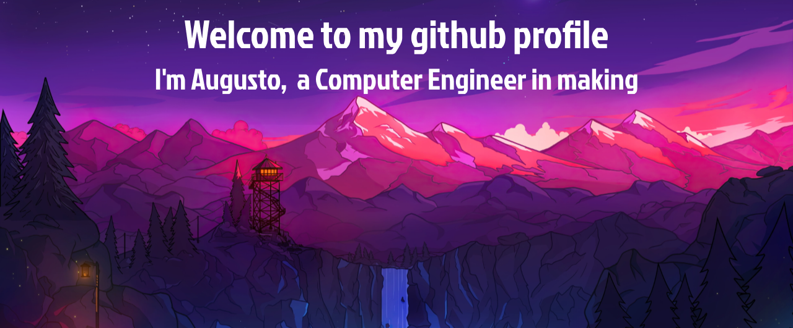

  
Hi! My name is Augusto Daleffe, I'm a computer engineer student at Universidade Federal de Santa Catarina (UFSC). This is my digital workspace, where I share projects and code related to my academic and professional journey in the field of computing. 

I'm constantly looking for challenges that allow me to apply my knowledge and creativity. I believe that programming goes beyond simple code. it's a way of expressing ideas and solving problems in an innovative way. That's why you'll see all kinds of code in this workspace.
 
 

## About me 
 📚 Computer Engineer Student at UFSC
 🚀 Exploring the challenges and possibilities of computing
 💻 Developing skills in various programming languages and technologies
 🌐 Committed to excellence and continuous learning

 

## Main Areas of Interest
 🧠 Artificial intelligence and machine learning
 🖥 Embedded Systems
 🌐 Web Development
 📱 Software Development

 

# 💻 Tech Stack:
      

